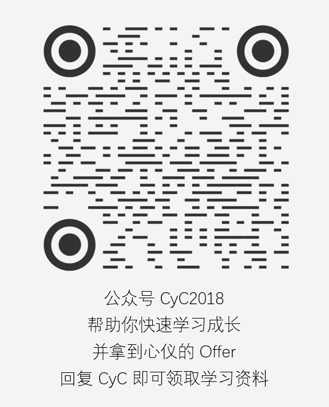

# Purpose

Some readers have poor network conditions, and online access can sometimes be slow enough to hurt the reading experience. In addition, offline formats such as PDF are more convenient for taking notes than the online web version, so offline reading versions are provided for download.

# Contents

There are three offline formats: PDF, Markdown, and HTML.

## PDF

The advantage is that it is convenient for taking notes. The disadvantages are that GIF images cannot be displayed, so PDF is not recommended for reading Sword Offer Solutions, and the rendering quality is not ideal.

## Markdown

The advantages are that GIF images display well and the rendering quality is good. The disadvantage is that all content is merged into one file, so real-time rendering can lag a little.

## HTML

The advantage is that its rendering is almost the same as Markdown, while it does not require real-time Markdown rendering, so browsing is faster. The disadvantage is that the table of contents feature is not very complete yet.

If you want to read on an Android phone, this format is recommended. Copy both the HTML file and image files to the phone, open the HTML file in a browser, and save it as a bookmark so you can read offline quickly later.

# How to Download

Offline versions are published through the **CyC2018** WeChat official account. The latest version is also released there promptly. Reply with **CyC** in the account backend to get the download link.

</img>

